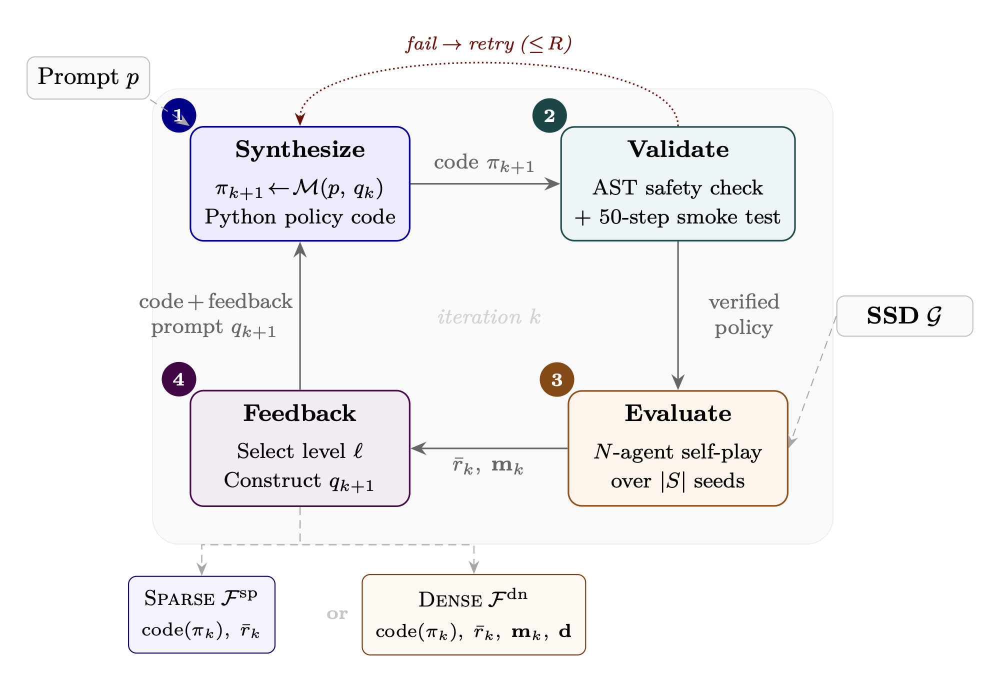

# Cooperation and Exploitation in LLM Policy Synthesis for Sequential Social Dilemmas

Code for the paper *"Cooperation and Exploitation in LLM Policy Synthesis for Sequential Social Dilemmas"* (pre-print, work in progress).

<p align="center">
  
  <br>
  <em>Iterative LLM policy synthesis framework. The LLM synthesizes a Python policy, which is validated, evaluated in N-agent self-play, and refined via sparse or dense feedback.</em>
</p>

<p align="center">
  
  <br>
  <em>Cleanup environment. Agents (colored arrows) must clean waste (brown, left) from the river so apples (green, right) can regrow.</em>
</p>

## Overview

We study **LLM policy synthesis**: using large language models to iteratively generate programmatic Python agent policies for multi-agent environments, evaluated in self-play, and refined through performance feedback. We compare **sparse feedback** (scalar reward only) vs. **dense feedback** (reward + social metrics: efficiency, equality, sustainability, peace) across two Sequential Social Dilemmas and two frontier LLMs (Claude Sonnet 4.6, Gemini 3.1 Pro).

**Key findings:**
- Dense feedback consistently matches or exceeds sparse feedback — social metrics act as a **coordination signal**, not a distraction.
- LLMs discover sophisticated strategies: Voronoi territory partitioning (Gathering), waste-adaptive role assignment (Cleanup).
- Code-level iteration significantly outperforms prompt-level optimization (GEPA baseline).
- Programmatic access enables **reward hacking**.

## Environments

Two Sequential Social Dilemmas from the multi-agent RL literature:

- **Gathering** ([Leibo et al., AAMAS 2017](https://arxiv.org/abs/1702.03037)): agents collect apples (+1 reward) with a fixed-timer respawn. A tagging beam can temporarily remove rivals. Dilemma: cooperate vs. attack.
- **Cleanup** ([Hughes et al., NeurIPS 2018](https://arxiv.org/abs/1803.08884)): a public goods game where a river accumulates waste and apples only regrow when the river is clean. Cleaning costs effort but benefits all agents. Dilemma: free-ride vs. contribute.

Both environments are Gymnasium-style with `reset()`/`step()` interfaces, egocentric RGB observations, and built-in social metrics (efficiency, equality, sustainability, peace).

## Installation

With [uv](https://docs.astral.sh/uv/):
```bash
uv run llm_self_play.py --help  # auto-installs deps from pyproject.toml
```

Set API keys as environment variables:
```bash
export GEMINI_API_KEY="..."      # for Gemini
```

The Sonnet model is currently only implemented through claude-agent-sdk (i.e., you need to have Claude Code installed and configured locally). 

## Usage

### Environment demo

```bash
# Run Gathering environment self-test (prints map stats, obs shape, social metrics)
uv run gathering_env.py

# Run Cleanup environment self-test
uv run cleanup_env.py
```

### Programmatic policies (no LLM required)

```bash
# Evaluate 7 scenarios comparing BFS / exploitative / cooperative / random agent mixes
uv run gathering_policy.py
```

Three built-in policies:
- **BFS greedy** — shortest path to nearest apple, never beams
- **Exploitative** — beams opponents in path, chases tagged targets, else collects
- **Cooperative** — spatially partitions apples via Voronoi assignment, never beams


### LLM self-play examples (main experiments)

```bash
# Gathering, Claude Sonnet, reward-only feedback (paper Table 1)
uv run llm_self_play.py --game gathering --model claude-sonnet-4-6 --mode reward-only \
    --iterations 3 --map large --n-agents 10


# Cleanup, Gemini, reward+social feedback
uv run llm_self_play.py --game cleanup --model gemini-3.1-pro-preview --mode reward+social \
    --iterations 3 --map large --n-agents 10

# Smoke test (1 iteration, 1 seed)
uv run llm_self_play.py --iterations 1 --eval-seeds 1
```

**Options for reproducing paper results:**
| Flag | Paper values |
|---|---|
| `--game` | `gathering`, `cleanup` |
| `--model` | `claude-sonnet-4-6`, `gemini-3.1-pro-preview` |
| `--mode` | `reward-only`, `reward+social` |
| `--iterations` | `3` |
| `--map` | `large` |
| `--n-agents` | `10` |
| `--eval-seeds` | `5` (default) |

### GEPA baseline and verifiers wrapper

To make the previous environment compatible with [verifiers](https://github.com/PrimeIntellect-ai/verifiers/) library, we provide a wrapper on `ssd_verifier_env.py`. While it should be possible to run RL with it, in the paper we only tested it with the GEPA prompt optimizer:

```bash
# Run GEPA for a single game
uv run run_gepa_ssd.py --game gathering

# Custom model or iterations
uv run run_gepa_ssd.py --model gemini-2.5-pro-preview --iterations 5
```

### Q-learning baselines

```bash
# Tabular Q-learning with cooperative reward shaping (Gathering)
uv run gathering_qlearning.py

# Tabular Q-learning with cooperative reward shaping (Cleanup)
uv run cleanup_qlearning.py
```

### Reward hacking demo

```bash
# Demonstrates environment mutation attacks (teleport, disable rivals, purge waste, spawn apples)
uv run demo_env_reward_hack.py
```

## File structure

```
gathering_env.py        # Gathering environment (GatheringEnv)
cleanup_env.py          # Cleanup environment (CleanupEnv), extends GatheringEnv
gathering_policy.py     # Programmatic policies (BFS, exploitative, cooperative) + evaluation
gathering_qlearning.py  # Tabular Q-learning baseline for Gathering
cleanup_qlearning.py    # Tabular Q-learning baseline for Cleanup
llm_self_play.py        # Iterative LLM policy synthesis (Claude / Gemini)
ssd_verifier_env.py     # Verifier wrapper for GEPA integration
run_gepa_ssd.py         # GEPA baseline runner
demo_env_reward_hack.py # Reward hacking attack demonstrations
assets/                 # Environment renders
```


## License

MIT
